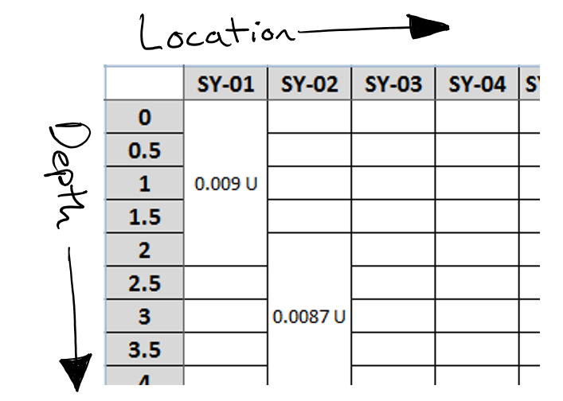
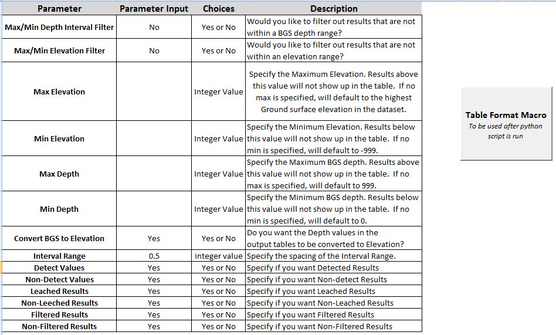

# Tabular Cross Section

#### Table of Contents:
 - [Description](https://github.com/SethDocherty/Tabular-Cross-Section#description)
 - [Running The Script](https://github.com/SethDocherty/Tabular-Cross-Section#running-the-script)
 - [Dependencies](https://github.com/SethDocherty/Tabular-Cross-Section#dependencies)

## Description:

This script takes a query table with analytical results for various CoC's (Contaminant of Concern) for one or more study areas and creates a formatted table that resembles a cross section.  The results are arranged with the 
depths on the y-axis and locations on the x-axis. 

#### Application:

When analyzing a CoC of results in a study area, it is necessary to examine the vertical distribution for each parameter. Looking at the spread of data vertically aids in getting to 
know the study area by focusing in on the impacted zones where the contamination occurs.

Quite often a user may need to analyze various contaminants within a study area which can be quite intensive.  To do this analysis, they must create a visual representation in their head 
and keep track of the impacted zones.  It is simply not possible to organize data in this manner to extrapolate the vertical distribution of data from a simple database/report table, especially 
if hundred’s of constituents are reviewed for multiple study areas. 

The tabular cross section script can aid the user in analyzing the data but normalizing the data by either depth or elevation.  Once the user identifies the impacted zones, they can 
streamline the dataset even further by re-running the script by specifying additional filters.  These filters include:
 - Max Elevation
 - Min Elevation
 - Max Depth
 - Min Depth

The final CoC tables are merged into one excel workbook for quick and easy access. Conditional formatting is used for automatic highlighting of results so impacted zones visually stick out to aid in 
analysis. Furthermore, up to three action limits can be used to highlight results that may be in excess of specific standards.   All tables are formatted as a report deliverable.

## Running The Script:

After saving the git package to a location on your computer, open the input parameter excel notebook. Since this is a macro-enabled workbook, you will need to click on the "Enable Content" button to the run 
the VBA portion of the script. There is a total of fourteen input parameters that can be modified to hone the output. Rows 4-7 will default to the specified value if left blank.

You will find an additional tab in this workbook named "Action Limits" where the specific remediation standards for each CoC is listed.  The values stored in this worksheet will be used for conditional formatting
in the final formatted tables.  Up to three standards can be used for highlighting results above the corresponding standard.  Each standard should be listed in a new column with the first one starting in column B.
the parameter names under column A should be spelled exactly as they are the data query to properly match the action limits.

The analytical data from the database query must be stored in the "Input Data" folder and saved as a .csv document with the filename as "input". The following fields are required in the input file:
 - Location ID
 - Field Sample ID
 - Start Depth
 - End Depth
 - Parameter Name (CoC)
 - Report Result (Analytical Result)
 - Leached
 - Detected
 - Filtered
 - Ground Elevation
 - Location Group Name (This is the study area(s))
 
The fields do not have to be arranged in any particular order and the data does not have to be sorted.  As long as the fields mentioned are spelled the same and are present in the input 
file, the script will extract the necessary columns and sort the data before processing.

Before pressing the "Table Format Macro" button, you must initially run the python script to format the input analytical data.  The python script can be found in the bin folder.

All the processed tables are stored in a folder based on the location group name (the study area) under "Output Data". Go back to the excel document and click on the "Table Format Macro" 
button. A window opens asking for input folder.  The input folder in this case is the name of the study area.  After running, another dialog window opens giving the user the option to save it.
If there are multiple location groups, you must run VBA macro for each one.  

## Dependencies:

To run the python script, the [xlrd](http://xlrd.readthedocs.io/en/latest/installation.html) library must be installed.  The easiest way to install this library is through pip with 
the following command: pip install xlrd.

If pip is not installed, please visit this [site](https://pip.pypa.io/en/stable/installing/) for more info.  If python has not been added as a system path, view the top answer on this 
[stack exchange post](http://stackoverflow.com/questions/3701646/how-to-add-to-the-pythonpath-in-windows-7) for instructions on how to it.

If your version of excel is 2007 or earlier, you will need to run use the
